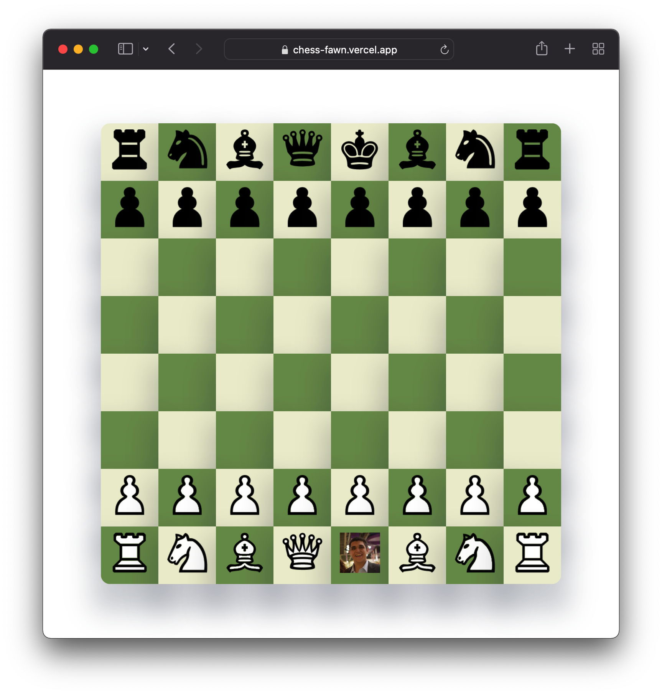

<!-- START doctoc generated TOC please keep comment here to allow auto update -->
<!-- DON'T EDIT THIS SECTION, INSTEAD RE-RUN doctoc TO UPDATE -->
**Table of Contents**

- [Multiplayer Chess game](#multiplayer-chess-game)
    - [Play chess online with your friends](#play-chess-online-with-your-friends)
  - [Getting started](#getting-started)
  - [Packages used](#packages-used)
    - [This repo covers the use of the following packages and technologies](#this-repo-covers-the-use-of-the-following-packages-and-technologies)
  - [Todo](#todo)

<!-- END doctoc generated TOC please keep comment here to allow auto update -->


# Multiplayer Chess game


### Play chess online with your friends




## Getting started

1. Clone this repository

   ```bash
   git clone https://github.com/MoustafaElhadary/chess.git
   ```

2. Install dependencies

      ```bash
      yarn
      ```
3. Create a **.env** file for the firebase config

    ```env
    NEXT_PUBLIC_SUPABASE_URL=
    NEXT_PUBLIC_SUPABASE_ANON_KEY=
    SUPABASE_SERVICE_KEY=
    ```
1. run 

      ```bash
      yarn dev
      ```

## Packages used
### This repo covers the use of the following packages and technologies 

  - Recoil ( State Management )
  - Supabase ( Auth, Database and realtime sockets )
  - React DnD ( Drag and Drop)
  - TypeScript ( because type safety is phenomenal )
    - autogenerated types from DB schema
  - NextJS ( React but opinionated)
  - TailwindCSS (utility first CSS)


## Todo

- [ ] Sign up
  - [ ] Email Password
  - [ ] Google
- [ ] Sign in
- [ ] Chess Rules
  - [ ] Castling
  - [ ] Promotions
- [ ] Online
- [ ] Local